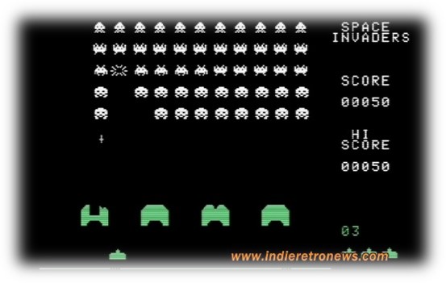
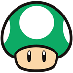

    

        
    

    

        
Računalniška Grafika

        

POROČILO IGRE: SPACE ARCADE 

          
         
          
        

        

            

                

                    Nik Čadež 63200072
                

                

                    Klemen Šuštar 63200300
                

                

                    Anže Vidmar 63200319
                

             

        

    

    

9. Januar 2022
    

# Kazalo

1. Uvod

1

1.1. Na kratko o igri

1

1.2. Inspiracija

1

2. Glasba in zvok

3

2.1. Glasba

3

2.2. Zvok

3

3. Gibanje in igranje igre

4

3.1. Gibanje

4

3.2. Igranje igre

4

4. Objekti

5

4.1. Igralec

5

4.2. Nasprotnikova letala

5

4.3. Vesoljsko kamenje

6

4.4. Planeti in obroč

6

4.5. Skybox

6

4.6. Naboji

6

4.7. Ščiti in kristali

7

5. Cilj igre in možnost nadgradnje

7

5.1. Cilj igre

7

5.2. Možne nadgradnje

7

6. Viri in literatura

8

# 1. Uvod

## 1.1. Na kratko o igri

Igra postavi igralca v vesolje, kjer se igralec poizkuša zoperstaviti krutim dejavnikom neusmiljenega vesolja. Njegova naloga je preživeti čim dlje časa in ob tem zbrati čim več kristalov. V napoto pa sta mu tudi dva različna tipa »zlobnih« letal ter kopica vesoljskih kamnov. Seveda pa ima igralec tudi pomoč, in sicer njegovo vesoljsko ladjo, ki mu omogoča izstreljevanje strelov in ga ščiti pred določenim številom udarcev.

<figure>
  
  <figcaption>Slika 1: Začetek igre</figcaption>
</figure>

## 1.2. Inspiracija

V inspiracijo nam je bila klasična vesoljska igra Space Invaders. Stara igra, ki je po vsem svetu poznana pa je potrebovala nujno prenovo. Po navodilih seminarja smo se odločili, da igro naredimo 3D in ji podamo nekaj svojih elementov. Želeli smo narediti nekaj zelo podobnega, vendar povsem drugačnega stari klasiki. Igralcu smo s pomočjo moderne vizualizacijske tehnologije poizkušali prikazati isti koncept igre na moderen način. Z osvetljevanjem 3D objektov smo vesolje naredili še bolj realistično.

<figure>
  
  <figcaption>Slika 2: Space Invaders</figcaption>
</figure>
    

Inspiracijo pa smo prav tako črpali iz okolja. Dinamično gibanje letal med letenjem smo prikazali pri igralčevi vesoljski ladji, ki se lahko giblje na  x in y koordinati. Hkrati pa smo poizkušali s pomočjo gibajočega kamenja igralcu pričarati občutek gibanja po z osi. 

    <figure>
  
  <figcaption>Slika 3: Dinamika gibanja letala</figcaption>
    </figure>

Teksture in modeli so dobili inspiracijo iz našega vesolja, naše zgodovine (kamikazi letala) in morskih živali (orka). Seveda pa brez znane žanre Star Wars vesolja ne moremo prikazati. Tako smo tudi iz filmske industrije pridobili nekaj idej. Pri teksturah pa lahko tudi opazimo retro gobico, ki jo lahko najdemo še v Super Mario svetu, ta pa je tam poznana pod nazivom one up – plus eno življenje.

<figure>
  
  <figcaption>Slika 4: Super Mario-one up</figcaption>
</figure>

<figure>
  
  <figcaption>Slika 5: Textura ščita</figcaption>
</figure>

Za zvok smo se poizkušali približati starim igram, ki so uporabljale podobne zvočne efekte. Tako smo izkušenemu igralcu lahko prikazali igro, ki je na prvi pogled povsem nova a hkrati znana in domača kot, da jo je nekoč morda že igral.

# 2. Glasba in zvok

## 2.1. Glasba

Kot že napisano, smo igro poizkušali narediti čim bolj domačo in znano. Hkrati pa smo igralcu poizkušali dvigniti nivo adrenalina in mu podati občutek, da se nekaj dogaja, nekaj resnega. Igralec se podaja na vesoljsko avanturo, v kateri bo moral pokazati vse svoje znanje in veščine pilotiranja vesoljskih plovil. Konec koncev gre za preživetje. S tem v mislih smo ob igri dodali staro bojevniško glasbo, ki se skozi igro neprestano ponavlja.

## 2.2. Zvok

Za zvočne efekte smo uporabljali zgolj retro efekte. Ti podajo igri star in znan občutek. Ko igralec nekaj zamoči, se predvaja zvok, ki igralca »kaznuje«. Ko se igra konča, se predvaja zvok, ki igralcu že sam po sebi sporoči, da je naredil svojo zadnjo napako. Vsi zvoki pa seveda niso igralcu neprijetni. Zvok laserja da igralcu občutek zabavne vesoljske igre. Tako se lažje vživi v vlogo vesoljskega pilota, ki poizkuša nabrati čim več kristalov. Prav tako naj bi pobiranje kristalov in ščitov igralcu sprožilo dva prijetna zvoka in mu takoj sporočilo, da je naredil nekaj dobrega. Hkrati pa ga stimuliralo k pobiranju še večih kristalov in ščitov.

Zvok smo uporabili tudi v meniju, kjer smo uporabili zvočne efekte, ki spominjajo na tiste iz Iger123.

<figure>
  
  <figcaption>Slika 6: Predvajanje zvoka na pritisk gumba</figcaption>
</figure>
    

# 3. Gibanje in igranje igre

## 3.1. Gibanje

Gibanje igralca je narejeno čim bolj dinamično in gladko. S tem igralcu podamo občutek, da resnično vozi neko vesoljsko ladjo. Prav tako pa smo tudi vesolje poizkušali narediti čim bolj dinamično. Premikajoče se kamenje, ki poizkuša zadeti igralca, naredijo igro še bolj zanimivo. Obroč kamenja, ki se vrti okoli planeta, vrteče kamenje in vrteči planeti podajo igri še boljši občutek in na koncu boljše doživetje.

## 3.2. Igranje igre

Vse komande s katerimi se igralec lahko sporazumeva z igro smo napisali v začetnem meniju. Prav tako pa smo uporabili standardni layout, ki je gotovo znan prav vsakemu igralcu.

<figure>
  
  <figcaption>Slika 7: Začetni meni</figcaption>
</figure>

# 4. Objekti

Objekti so narejeni s programom Blender^1^, teksture objektov pa so narejene z Procreate^2^.

## 4.1. Igralec

Igralec je postavljen v vlogo 3D modela Star Wars letala. Tekstura je narisana ročno. Letalo pa se giblje dinamično. Omejen je z okvirjem pogleda kamere. Njegova hitrost v smeri osi z pa je enaka 0. – Morda na prvi pogled ne izgleda tako. Za občutek premikanja pa smo uporabili druge objekte, ki s svojo hitrostjo v smeri letala, igralcu podajajo občutek hitrosti. Letalo ima prav tako zmožnost streljanja nabojev. Odmikati se mora skalam in drugim nabojem, hkrati pa mora pobirati kristale in ščite. Določeno število ščitov (življenj) ima že na začetku.

<figure>
  
  <figcaption>Slika 8: Letalo igralca</figcaption>
</figure>
    

## 4.2. Nasprotnikova letala

Nasprotnikova letala imajo nekoliko bolj trdo gibanje, ki spominja na gibanje iz igre Space invaders. Ta letala prav tako lahko streljajo naboje in igralcu predstavljajo izziv, da jih zadane, saj mu prinesejo točke. Hkrati pa mora paziti, da ga naboji nasprotnikovega letala ne zadanejo. Nasprotnikova letala lahko najdemo v obliki dveh modelov in sicer modela orke ter modela kamikazi letala.

<figure>
  
  <figcaption>Slika 9: Nasprotnikovo letalo v igri</figcaption>
</figure>
    

<figure>
  
  <figcaption>Slika 10: Nasprotnikovo letalo kamikazi</figcaption>
</figure>
    

<figure>
  
  <figcaption>Slika 11: Nasprotnikovo letalo kamikazi</figcaption>
</figure>
    

<figure>
  
  <figcaption>Slika 12: Nasprotnikovo letalo orka</figcaption>
</figure>
    

## 4.3. Vesoljsko kamenje

Vesoljsko kamenje predstavi igralcu še največji izziv, saj ga ne more uničiti s streljanjem nabojev. Kamenju se mora odmikati in mu preprečiti da ga zadane. Kamenje se giblje po z osi, hkrati pa se giblje okoli svoje osi. Tako deluje bolj dinamično in resnično. Kamenje, ki prileti, je tudi različnih velikosti in oblik. Od same velikosti kamenja pa je odvisna tudi njegova hitrost. Igralec ima pri večjih modelih več časa za odmik, saj se gibljejo počasneje, kot pa tisti manjših oblik.

Dodali smo tudi stezo kamenja, ki teče pod letalom in daje občutek premikanja naprej. 

<figure>
  
  <figcaption>Slika 13: Vesoljsko kamenje</figcaption>
</figure>

<figure>
  
  <figcaption>Slika 14: Kamnita steza</figcaption>
</figure>

## 4.4. Planeti in obroč

Planeti so zgolj dekorativni in so v sceni zgolj zaradi ambienta. Nekateri planeti se tudi zelo počasi vrtijo. Imajo pa tudi zelo zanimive teksture, saj je njihov glavni namen popestriti sceno. Okoli nekaterih planetov je tudi obroč kamenja. Slednji pa se ob enem tudi vrtijo in dodajo k občutku resničnega vesolja.

<figure>
  
  <figcaption>Slika 15: Vesoljsko kamenje</figcaption>
</figure>

<figure>
  
  <figcaption>Slika 16: Kamnita steza</figcaption>
</figure>

<figure>
  
  <figcaption>Slika 17: Kamnita steza</figcaption>
</figure>

 

## 4.5. Skybox

Zvezdasto ozadje, ki predstavlja vesolje. Sem spada tudi sonce. Ima tudi svoj senčilnik.

## 4.6. Naboji

Objekti, ki jih streljajo letala in so namenjena napadu na druga nasprotnikova letala.

## 4.7. Ščiti in kristali

Tovrstni elementi so namenjeni igralcu v igri pomagati in mu dajejo smisel za igranje. »Zberi čim več kristalov in si naberi čim več točk«. Ščiti pa igralcu vsak zase dajejo ponovno možnost v primeru nezgode- »dodatno življenje«. Oboji imajo teksturo, ki je nekoliko drugačna in izstopa izven vesolja. Najbolj zanimiva je tekstura ščita, ki ima ob podrobnejšem pogledu nanj tudi neko sporočilo.

<figure>
  
  <figcaption>Slika 18: Kristal</figcaption>
</figure>

<figure>
  
  <figcaption>Slika 19: Ščit</figcaption>
</figure>

# 5. Cilj igre in možnost nadgradnje

## 5.1. Cilj igre

Cilj igre je preživeti čim dlje, ob enem pa pobrati čim več kristalov. Točk pa ne prinašajo samo kristali- temveč tudi nasprotnikova letala ob razstrelitvi le teh. Tako na koncu igralec tekmuje sam s sabo in poizkuša preseči samega sebe v zbranih točkah.

## 5.2. Možne nadgradnje

Igri bi lahko dodali več bolj sofisticiranih nasprotnikovih letal, ki bi igro naredila še bolj zanimivo. Ob enem bi lahko naredili več stopenj, ki bi se konstantno menjale skozi igro. Prav tako bi lahko spremenili same funkcije nasprotnikovih ladij – vsaka napade na svoj unikaten način. Možnih nadgradenj je veliko. 

# 6. Viri in literatura

- https://freesound.org/people/Migfus20/sounds/562604/ 

- https://freesound.org/people/kafokafo/sounds/128349/ 

- https://freesound.org/people/cabled_mess/sounds/350970/ 

- https://freesound.org/people/newagesoup/sounds/350359/ 

- https://freesound.org/people/Kenneth_Cooney/sounds/609335/ 

- https://freesound.org/people/myfox14/sounds/382310/ 

- http://www.indieretronews.com/2021/03/space-invaders-on-c64-by-mariano-as-his.html 

- https://www.mariowiki.com/Gallery:1-Up_Mushroom

- A. Aguilar, David.,The sun v National geographic kids (online). 2015-2021. Dostopno na: https://kids.nationalgeographic.com/space/article/sun 
